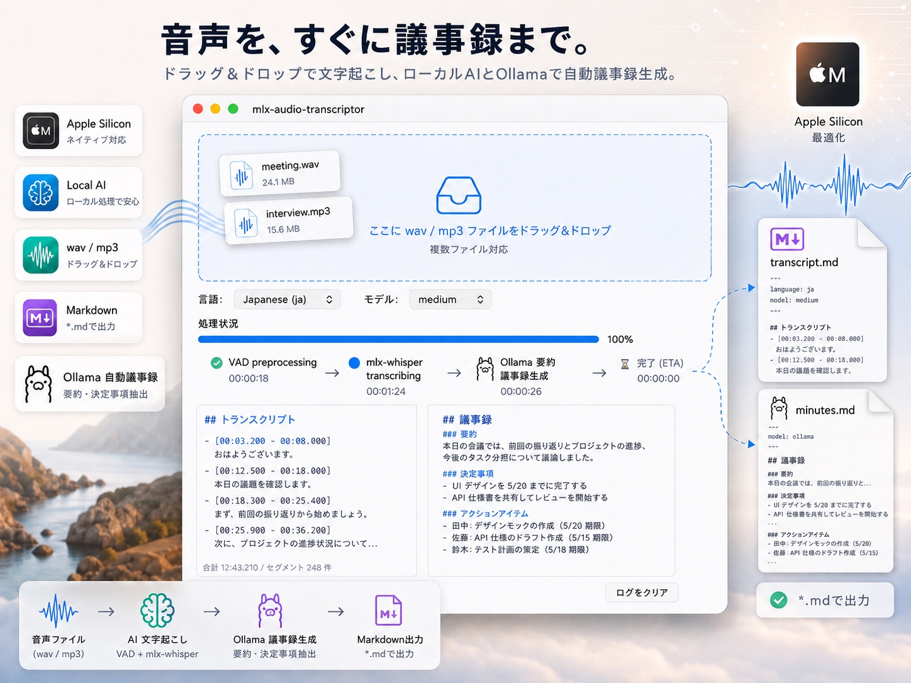

# audio-transcriptor



macOS 上で音声ファイルを文字起こしし、議事録 Markdown を自動生成するローカルアプリ。

## 特徴

- 音声ファイルを文字起こしし、議事録 Markdown を生成
- 利用可能な場合は Apple のオンデバイス機能（SpeechAnalyzer / Foundation Models）を自動使用
- 追加セットアップなしで動作する構成を優先
- 旧環境では mlx-whisper / Ollama にフォールバック可能

## 2 つの軸（使い方とバックエンドは別物）

このアプリは**直交する 2 つの軸**で構成される。混同しないことが理解の近道。

| 軸 | 内容 | 選択肢 |
|---|---|---|
| **使い方**（どう起動するか） | アプリの操作方法。バックエンドに関係なく不変 | A. GUI アプリ / B. Downloads 自動監視（launchd） |
| **処理方式**（どのバックエンドで処理するか） | 文字起こし・議事録のエンジン選択 | Apple ネイティブ（V2）↔ mlx-whisper / Ollama（legacy） |

- 「**使い方**」は GUI と Downloads 自動監視の 2 通りで、どちらを選んでもバックエンドの選択とは独立している。詳細手順は [`docs/usage.md`](docs/usage.md) を参照。
- 「**レガシー**」という語は**処理方式（バックエンド）の話**であり、使い方（GUI かどうか）の話ではない。GUI も Downloads 監視も、内部では同じ v2 パイプライン抽象を通り、`mode` に応じてバックエンドを選ぶ。

## 動作環境

| 項目 | 要件 |
|---|---|
| OS | macOS。Apple のオンデバイス機能（SpeechAnalyzer / Foundation Models）を使う場合は **macOS 26 以降** |
| チップ | Apple Silicon（mlx-whisper を使う場合は必須） |
| Python | 3.11 以上 |
| Swift ツールチェイン | Apple helper の自動ビルドに必要（**Xcode** または **Command Line Tools**）。`xcode-select --install` で導入できる。macOS 26 以降かつ `swift` が利用可能なら、初回実行時に自動ビルドされる |

- 通常は `mode = "auto"` で、環境に応じて最適な処理方式を自動選択する。
- **Apple SpeechAnalyzer / Foundation Models は macOS 26 以降**で利用できる。Swift helper は**初回実行時に自動ビルド**される（`swift build` を手動で叩く必要はない。詳細は [Apple helper（自動ビルド）](#apple-helper自動ビルド--macos-26-以降)）。
- 上記が満たせない環境（macOS 26 未満 / Swift 無し / ビルド失敗 など）では、自動的に mlx-whisper / Ollama にフォールバックする（[処理方式（バックエンド）](#処理方式バックエンド)）。
- **legacy バックエンド（mlx-whisper）を使う場合は別途 `ffmpeg` が必要**（音声デコード用。`.mp3` 等で必須）。詳細は [`docs/usage.md`](docs/usage.md#legacy-バックエンドの事前準備mlx-whisper--ollama) を参照。

## インストール

```bash
python -m venv .venv
source .venv/bin/activate
pip install -r requirements.txt
```

## 使い方

使い方は 2 通り。どちらもバックエンドの選択（auto / apple_native / legacy）とは独立して動く。
**詳細な操作手順・議事録生成・自動 PR などは [`docs/usage.md`](docs/usage.md) を参照。**

| 使い方 | 向いている場面 | 操作 |
|--------|---------------|------|
| **A. GUI アプリ** | 任意のファイルをその都度処理したい | `python -m app.main` で起動し、音声ファイルをドラッグ&ドロップ |
| **B. Downloads 自動監視（launchd）** | iPhone から AirDrop で送った音声を放置で処理したい | LaunchAgent をインストール（初回のみ）。以降は `~/Downloads` に置くだけ |

出力は音声ファイルと同じフォルダに `*.transcript.md`（文字起こし）と
`*.minutes.md`（議事録）として保存される。

### 補助: CLI コマンド

GUI を使わず、バックエンドの確認や単発の文字起こしをコマンドで行うこともできる。

```bash
# 検出されたバックエンドと自動選択結果を表示
python -m app.cli capabilities

# 指定ファイルを文字起こし＋議事録生成
python -m app.cli transcribe path/to/meeting.m4a

# 文字起こしと要約を個別に上書き（例: 要約だけ Apple Foundation に固定し Ollama を使わない）
python -m app.cli transcribe path/to/meeting.m4a --summary-backend apple_foundation

# 文字起こしは mlx-whisper、要約は無効化（文字起こしのみ）
python -m app.cli transcribe path/to/meeting.m4a \
    --transcription-backend mlx_whisper --summary-backend none
```

`--mode` / `--transcription-backend` / `--summary-backend` は `capabilities` と
`transcribe` の両方で使え、その実行に限り設定ファイルの値を上書きする。

> `python -m app.cli scan` は Downloads 自動監視（launchd）が内部で呼ぶコマンド。

## 処理方式（バックエンド）

文字起こし・議事録生成のエンジンは `mode` で選択する。GUI / Downloads 監視 / CLI のいずれの使い方でも共通。

### 自動選択の優先順位

| 処理 | 優先順位 |
|---|---|
| 文字起こし | Apple SpeechAnalyzer（V2）→ mlx-whisper（legacy。要 ffmpeg） |
| 議事録生成 | Apple Foundation Models（V2）→ Ollama（legacy）→ なし |

### mode

| mode | 意味 |
|---|---|
| `auto` | 利用可能な最良バックエンドを自動選択（推奨） |
| `apple_native` | Apple Speech + Apple Foundation を要求。失敗時は停止 |
| `legacy` | mlx-whisper + Ollama を優先 |

### 文字起こし／要約の個別指定

`mode` は全体プリセット。文字起こしと要約のバックエンドは **それぞれ独立に** 固定できる
（`auto` のときは `mode` に従う）。たとえば文字起こしは auto のまま、要約だけ Apple Foundation に
固定して Ollama を使わない、といった制御が可能。

- GUI: 「処理方式」に加えて「文字起こし」「要約」のドロップダウンで個別に選択
- CLI: `--transcription-backend` / `--summary-backend` フラグ
- 設定ファイル: `[advanced] transcription_backend` / `summary_backend`

| 設定 | 選択肢 |
|---|---|
| 文字起こし | `auto` / `apple_speech` / `mlx_whisper` |
| 要約 | `auto` / `apple_foundation` / `ollama` / `none` |

- `auto` モードでは実行時の失敗も自動でフォールバックする（例: Apple Foundation が失敗したら Ollama → なし）。
- **legacy バックエンド（mlx-whisper / Ollama）** を使う場合の事前準備（ffmpeg / Ollama のインストール、対応モデル）は [`docs/usage.md`](docs/usage.md#legacy-バックエンドの事前準備mlx-whisper--ollama) を参照。

### Apple helper（自動ビルド / macOS 26 以降）

Apple SpeechAnalyzer / Foundation Models 用の Swift helper は、**初回実行時に自動でビルド**される
（GUI / CLI どちらでも）。手動で `swift build` する必要はない。条件は次のとおり:

- macOS 26 以降
- Swift ツールチェイン（Xcode または Command Line Tools）が入っていること

初回だけビルドに時間がかかり、以降はビルド済みバイナリ（`helpers/*/.build/release/`）が再利用される。
ビルド不可・利用不可の環境では mlx-whisper / Ollama に自動フォールバックする。

自動ビルドを止めたい場合は環境変数 `AUDIO_TRANSCRIPTOR_NO_HELPER_BUILD=1` を設定する。手動ビルドも可:

```bash
(cd helpers/apple-transcribe && swift build -c release)
(cd helpers/apple-summarize && swift build -c release)
```

## 基本設定

通常は設定不要です。アプリは利用可能な処理方式を自動で選択します。

```toml
[app]
mode = "auto"
```

設定例は [`config.example.toml`](config.example.toml) を参照。

## 対応ファイル

受け付ける拡張子（大文字小文字不問）: `.wav` `.mp3` `.m4a` `.aac` `.flac` `.ogg` `.aiff` `.caf`

| バックエンド | デコード可否 |
|------|------|
| Apple SpeechAnalyzer | macOS（AVFoundation）が対応する形式 |
| mlx-whisper | `ffmpeg` がデコードできる形式（要 ffmpeg） |

## テスト

```bash
pytest
```

## プロジェクト構成

```
audio-transcriptor/
├── app/
│   ├── main.py            # GUI エントリーポイント
│   ├── cli.py             # CLI（scan / capabilities / transcribe）
│   ├── config/            # TOML 設定（schema.py / loader.py）
│   ├── core/              # v2: models / capabilities / pipeline / errors / helper
│   ├── transcription/     # v2: TranscriptionBackend（apple_speech / mlx_whisper）
│   ├── summary/           # v2: SummaryBackend（apple_foundation / ollama / none）
│   ├── io/                # v2: Markdown writers / 音声拡張子
│   ├── ui/                # PySide6 ウィジェット（GUI）
│   ├── services/          # ロジック層（transcriber / vad / minutes / auto_pr ほか）
│   ├── workers/           # QThread ワーカー
│   └── models/            # Segment / TranscriptionResult
├── helpers/               # Swift helper CLI（apple-transcribe / apple-summarize）
├── scripts/               # launchd watcher のインストール/アンインストール
├── docs/
│   ├── usage.md           # 使い方（GUI / Downloads 自動監視）の詳細手順
│   └── mac-watcher-setup.md
├── config.example.toml    # auto モード設定例
├── config.toml.example    # 詳細設定例（議事録 / 自動 PR ほか）
└── tests/
```

> `app/transcription` / `app/summary` の各バックエンドが v2 パイプラインの実体。mlx-whisper / Ollama 経路は
> それぞれ `mlx_whisper` / `ollama` backend の内部に内包される（legacy バックエンド）。

## 依存パッケージ

- [PySide6](https://doc.qt.io/qtforpython/) — GUI
- [mlx-whisper](https://github.com/ml-explore/mlx-examples/tree/main/whisper) — 音声文字起こし（Apple Silicon MLX。legacy バックエンド）
- [silero-vad](https://github.com/snakers4/silero-vad) — 無音区間検出（VAD 前処理）
- [soundfile](https://python-soundfile.readthedocs.io/) — 音声ファイル読み込み
- [Send2Trash](https://github.com/arsenetar/send2trash) — 自動監視モードで元ファイルをゴミ箱へ送る

**外部ランタイム（任意）**

- [Ollama](https://ollama.com/) — 議事録生成（legacy バックエンド。Python パッケージ追加なし。stdlib `urllib.request` で疎通するため `requirements.txt` の変更は不要）

## 制限事項

- 話者分離・自動言語判定・動画ファイルは非対応
- キャンセル・一時停止機能なし
- `.app` 化非対応
- 議事録生成は best-effort で、バックエンドが全滅した場合はトランスクリプトのみ出力する
- Apple のオンデバイス機能は macOS 26 以降が必要。未満の環境では mlx-whisper / Ollama を使用する
